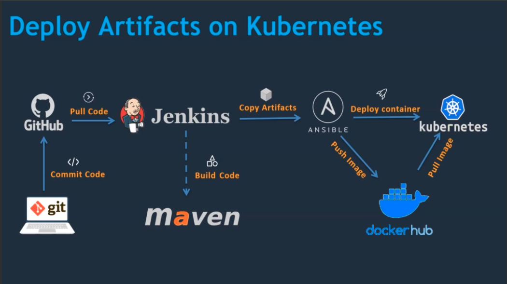

# Walkthrough of DevOps CI/CD Course

## Overview

This DevOps project aims to deploy an application across three different target environments: Virtual Machines (VM),
Docker containers, and Kubernetes clusters. The course covers the setup of Continuous Integration/Continuous
Deployment (CI/CD) pipelines using GitHub, Jenkins, Maven, Tomcat, Docker, Ansible, and Kubernetes.

## VM Deployment

1. **Setting up Jenkins Server:**
- Initial environment setup starts with Jenkins server installation.
- Configuring Maven and Git for code management.
- Setting up Tomcat server and integrating it with Jenkins.

2. **CI/CD Pipeline for VM:**
- Creating a Jenkins job to build and deploy the application on a Tomcat server.
- Testing the deployment to ensure functionality.

## Docker Container Deployment

1. **Docker Environment Setup:**
- Configuring Docker environment using GitHub, Jenkins, Maven, and Docker.
- Writing Dockerfile, creating an image, and deploying a container on Docker host.

2. **CI/CD Pipeline for Docker:**
- Integrating Docker host with Jenkins.
- Creating a Jenkins job to build and deploy the application on a Docker container.

## Ansible Deployment on Container

1. **Ansible Integration:**
- Setting up Ansible server and integrating it with Docker host.
- Using Ansible Playbooks to create Docker images and containers.

2. **CI/CD Pipeline for Ansible on Docker:**
- Creating a Jenkins job to build code with Ansible and deploy it on a Docker container.
- Committing artifacts to Docker Hub using Ansible Playbooks.

## Kubernetes Cluster Deployment

1. **Kubernetes Setup on AWS:**
- Setting up Kubernetes on AWS using Elastic Kubernetes Service (EKS).
- Writing pod, service, and deployment manifest files for Kubernetes.

2. **Integrating Kubernetes with Ansible:**
- Integrating Kubernetes with Ansible for automation.

3. **CI/CD Pipeline for Kubernetes:**
- Creating a Jenkins job to build code with Ansible and deploy it on a Kubernetes cluster.

## Conclusion

In the end of this project we expected to have a complete SDLC defined, up and running.

