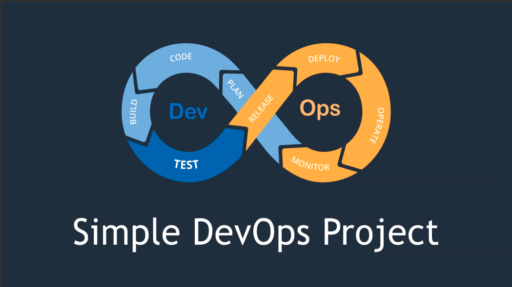
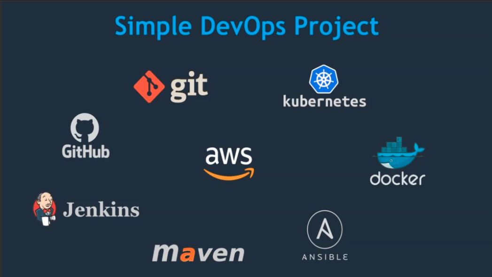
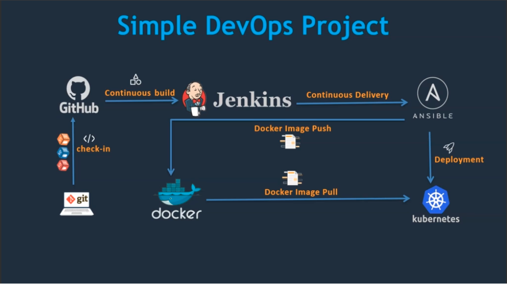

# Simple DevOps Project

## Overview

This project aims to provide a hands-on experience in setting up a complete CI/CD pipeline for a Java application using
various DevOps tools. The primary focus is on understanding the logical flow of a DevOps project and collaboratively
utilizing key tools.

## Tools Used

- **Version Control:**
- Git (Local Version Control System)
- GitHub (Distributed Version Control System)

- **Continuous Integration:**
- Jenkins

- **Build Tool:**
- Maven

- **Configuration Management and Deployment:**
- Ansible

- **Containerization:**
- Docker

- **Container Management:**
- Kubernetes

## Environment Setup

The entire DevOps environment will be set up on AWS.

## DevOps Workflow

1. **Source Code Management:**

- Developers commit code to Git (local) and GitHub (distributed) during the development phase.

2. **Continuous Integration:**

- Jenkins is used as the continuous integration tool to build the code, generating artifacts.

3. **Artifact Deployment:**

- Ansible is employed as the deployment tool to deploy artifacts onto the target environment.

4. **Target Environments:**

- Initially, the application is deployed on a VM.
- Subsequently, deployment is extended to a Docker container.
- Finally, deployment on a Kubernetes cluster is implemented.

## Learning Journey

Participants will go through the following stages:

1. Set up a local and distributed version control system.
2. Implement continuous integration using Jenkins.
3. Utilize Maven as the build tool.
4. Employ Ansible for configuration management and deployment.
5. Containerize the application with Docker.
6. Manage containers with Kubernetes.

### Git Commit Process:

1. **Developers Commit Code:**
- Developers locally commit code changes using Git.

2. **Push to GitHub:**
- The committed code is pushed to the GitHub repository for collaboration and version control.

### Jenkins Continuous Integration Process:

3. **Jenkins Job Trigger:**
- Jenkins is set up to monitor the GitHub repository for any changes.

4. **Code Build:**
- Upon detecting changes, Jenkins triggers a build job.
- Jenkins fetches the latest code from GitHub and compiles/builds the Java application.

5. **Artifact Generation:**
- After a successful build, Jenkins generates artifacts (compiled code, libraries, etc.).

### Ansible Deployment Process:

6. **Ansible Configuration:**
- Ansible playbooks are created to define the deployment configurations.

7. **Artifact Deployment:**
- Jenkins triggers an Ansible playbook after the build is successful.
- Ansible deploys the generated artifacts onto the target environment.

8. **Deployment on Various Environments:**
- Initially, the application is deployed on a VM.
- Subsequently, deployment is extended to a Docker container.
- Finally, deployment on a Kubernetes cluster is implemented.

### Project Progression:

9. **Commit, Build, and Deploy Iteration:**
- Developers continue to commit code changes.
- Jenkins continuously monitors for changes and triggers the build process.
- Ansible ensures the deployment of artifacts to the target environment.

10. **Scaling Deployments:**
- Deployments are scaled to different environments - VM, Docker container, and Kubernetes - showcasing the
  versatility of the CI/CD pipeline.

11. **Final CI/CD Setup:**
- By the end of the course, the complete CI/CD pipeline is established, allowing for automated integration, build,
  and deployment across various environments.

## Documentation 

Start checking out the [`walkthrough.md`](./documents/walkthrough.md). 